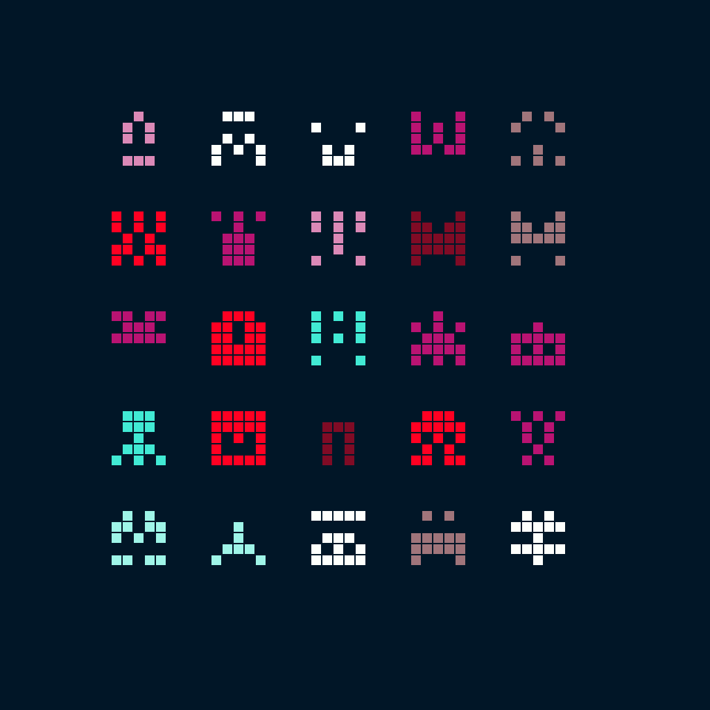

# nuunamnir.wallpaper-spaceinvaders
## Description
Generate a simple wallpaper with randomly generated spaceinvader-inspired entities.
## Usage
To generate a wallpaper with the default setting, simply run:
```
./generate.py wallpaper.png
```
If you add the `-h` argument you can see the other available configration options.
## Output
